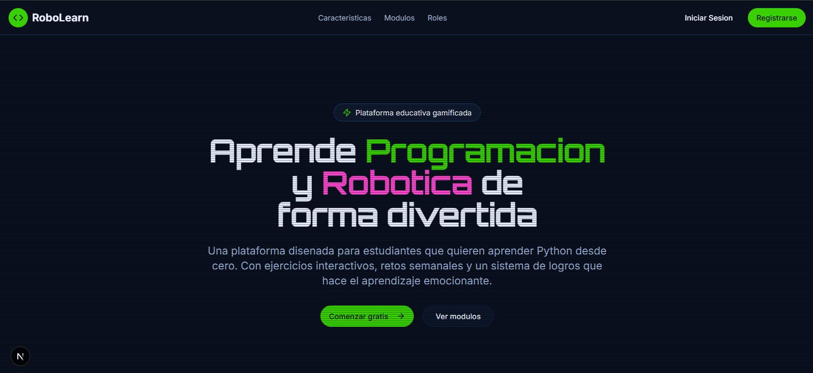
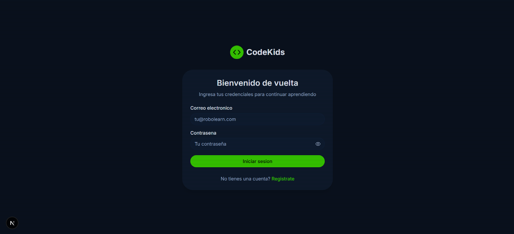
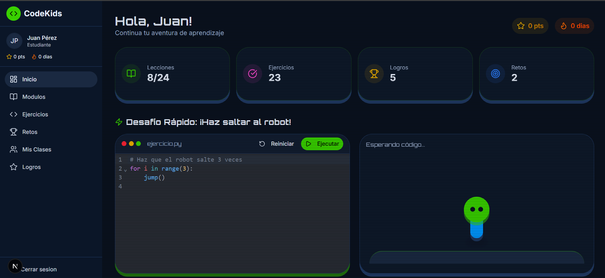

# Robolearn

Plataforma web para el aprendizaje de programación y robótica para niños y adolescentes.

> **Note**
> Este proyecto cuenta con arquitectura hexagonal. Las tecnologías principales son **Next.js** para el frontend, **FastAPI** para el backend y **Dialogflow** para el chatbot.

## Integrantes

- Perez Ravelo Angel Simon
- Rojas Quispe Angela Deniss
- Velasquez Palomino Kevyn L
- Tucto Ubaldo Ricardo David

## Tecnologías

- **Frontend**: Next.js (React), TailwindCSS, TypeScript
- **Backend**: FastAPI, Python, PostgreSQL, MongoDB (para logs/eventos)
- **Chatbot**: Dialogflow
- **Arquitectura**: Arquitectura Hexagonal (Puertos y Adaptadores)

> [!Important]
> Algunas secciones siguen en construcción, pero buscamos brindarles la mejor experiencia posible.

El proyecto tiene un aspecto amigable y muy divertido para los estudiantes, cuenta con una interfaz muy intuitiva y fácil de usar.

## Despliegue

### Despliegue de desarrollo (local sin Docker)

```bash
git clone https://github.com/proyecto1235/Tallerproyecto.git

cd backend
python3.11 -m venv .venv
source .venv/Scripts/activate.ps1
pip install -r requirements.txt
uvicorn app.main:app --reload

# En otra terminal
cd frontend
npm install
npm run dev
```

### Despliegue con Docker (Recomendado)

**Requisitos:**
- Docker Desktop instalado y corriendo
- Docker Compose v2.0+

**Pasos:**

1. **Clonar el repositorio:**
```bash
git clone https://github.com/proyecto1235/Tallerproyecto.git
cd Tallerproyecto
```

2. **Configurar variables de entorno (opcional para desarrollo):**
```bash
# Para producción, crear un archivo .env con valores seguros:
POSTGRES_PASSWORD=tu-contraseña-segura
MONGO_INITDB_ROOT_PASSWORD=tu-contraseña-mongo-segura
SECRET_KEY=tu-clave-secreta-generada-aleatoriamente
```

3. **Levantar todos los servicios:**
```bash
docker-compose up -d
```

4. **Verificar que todos los contenedores estén corriendo:**
```bash
docker-compose ps
```

**Servicios disponibles después del despliegue:**
- 🌐 **Frontend**: http://localhost:3000
- 🔌 **Backend API**: http://localhost:8000
- 📊 **API Docs (Swagger)**: http://localhost:8000/docs
- 🐘 **PostgreSQL**: localhost:5432
- 🍃 **MongoDB**: localhost:27017

**Comandos útiles:**

```bash
# Ver logs de un servicio específico
docker-compose logs -f backend
docker-compose logs -f frontend

# Detener todos los servicios
docker-compose down

# Eliminar volúmenes y datos (CUIDADO: elimina bases de datos)
docker-compose down -v

# Reconstruir imágenes (después de cambios en Dockerfile)
docker-compose up -d --build

# Acceder a un contenedor
docker exec -it robolearn_backend bash
docker exec -it robolearn_frontend sh
```

**Estructura de contenedores:**
- `robolearn_postgres`: Base de datos relacional
- `robolearn_mongo`: Base de datos de eventos/logs
- `robolearn_backend`: API FastAPI (puerto 8000)
- `robolearn_frontend`: Aplicación Next.js (puerto 3000)


Página principal de la aplicación.


Página de inicio de sesión.


Panel principal de la aplicación.

Agradecemos el apoyo de todos los participantes del proyecto y seguiremos mejorandolo para que sea algo muy bonito :)

